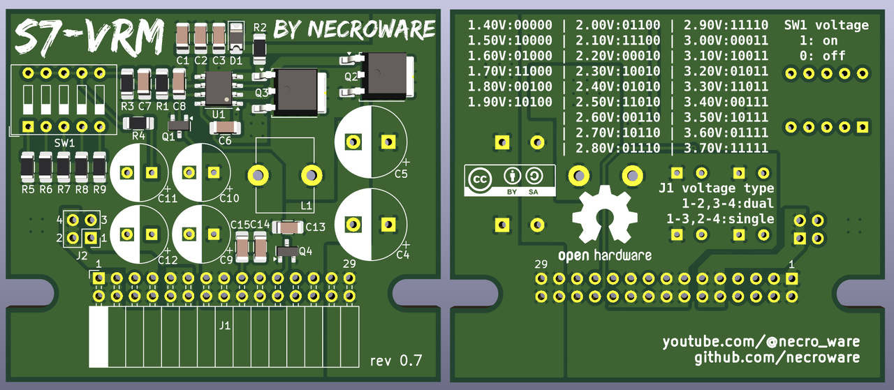

# Necroware's S7-VRM

This project is a Voltage Regulator Module for the Socket 7 mainboards as
defined by Intel in it's Pentium® Processor Flexible Motherboard Design
Guidelines. You can upgrade VRM capable Socket 7 mainboards with this module to
be able to use dual-voltage CPUs like Intel Pentium MMX, AMD K6, AMD K6-2 etc.

Youtube Videos:
- Part 1: https://youtu.be/CMiGVQbMC5U
- Part 2: https://youtu.be/J0NLGfocviU
- Part 3: https://youtu.be/kBPp9EAIC8I

## Voltage selection

Various voltages can be set using the SW1 switch on the module (0=off, 1=on):

Voltage | Switches | CPU Examples
--------|----------|-------------------------------------------
  3.2V  |   0000   | AMD K6 (only 233 MHz)
  2.9V  |   1000   | AMD K6, IBM 6x86MX
  2.8V  |   0100   | Intel Pentium MMX, IBM 6x86L, Rise MP6
  2.6V  |   1100   | ???
  2.4V  |   0010   | AMD K6-2
  2.3V  |   1010   | AMD K6-2
  2.2V  |   0110   | AMD K6 / K6-2(+) / K6-3(+) (and mobile)
  2.1V  |   1110   | AMD Mobile K6 / K6-2
  2.0V  |   0001   | AMD Mobile K6 / K6-2(+) / K6-3(+)
  1.9V  |   1001   | AMD K6-2E+
  1.8V  |   1101   | AMD Mobile K6-2(+)
  1.7V  |   0111   | AMD K6-2E+ / K6-3E+
  1.6V  |   1111   | AMD K6-2E+ / K6-3E+

## Important remarks

The transistor Q1 with integrated pull-up resistor is optional. It is used for 
enable/disable signal and is unused on most mainbards.

The PCB is made for a through hole inductor, but if you have only SMD it is also
possible to solder that instead. Keep in mind that the inductor has to stand
the required current. Also slightly different inductors are allowed, everything
between 2µH and 4,7µH should work as well. With the higher inductance you get
less current ripple, also voltage ripple can look better, but the maximum
possible current will decrease. Playing with different inductors will also
influence the compensation network.

Capacitors C7 and C8 are used in so called compensation network and are
responsible for DC-DC converter activation and stability. Those parts are very
delecate and dependent on the ESR and values of the output capacitors C9-C12,
and the inductor L1. If your regulator shows stability issues or not starting
at all, try to remove the capacitor C8. If you change any other parts C7, C8 and
R1 have to be adapted accordingly.

## Bill of materials

Part        | Count | LCSC#    | Comment
------------|-------|----------|--------------------------------------------
C1, C15     | 2     | C13585   | 10u capacitor SMD 1206
C2, C14     | 2     | C51205   | 4.7u capacitor SMD 1206
C3, C6, C13 | 3     | C696845  | 0.1u capacitor SMD 1206
C4, C5      | 2     | C407862  | 3300u capacitor TH Radial D10.0mm, P5.00mm
C7          | 1     | C107186  | 220n capacitor SMD 1206
C8          | 1     | C541493  | 39p capacitor SND 1206
C9-C12      | 4     | C407858  | 1000u capacitor TH Radial D8.0mm, P3.5mm
D1          | 1     | C109000  | Switching diode
J1          | 1     | C2897435 | Connector angled 02x15 pins 2.54mm 
L1          | 1     | C230667  | 2,5µH inductor TH or SMD P10.0mm at least 15A
Q1          | 1     | C13871   | NPN-Transistor with pull-up BEC
Q2, Q3      | 2     | C496603  | N-MOSFET GDS at least 15A
R1, R2, R6  | 3     | C144515  | 15K resistor SMD 1206
R3, R10     | 2     | C144508  | 1K resistor SMD 1206
R4, R8      | 2     | C229609  | 3K resistor SMD 1206
R5          | 1     | C3000607 | 21K resistor SMD 1206
R7          | 1     | C229767  | 6,3K resistor SMD 1206
R9          | 1     | C352163  | 0K resistor SMD 1206
SW1         | 1     | C15781   | DIP6 Switch THT 4 buttons 2.54mm
U1          | 1     | C235991  | NCP1579 DC-DC Controller

If the NCP1579 is not available, probably ISL6545, NCP1587 or L6726 will work
as well, but they haven't been tested yet.

## License

This work is licensed under the Creative Commons Attribution-ShareAlike 4.0
International License.

## Links
* [Intel Pentium Mainboard Design Guidelines](http://netwinder.osuosl.org/pub/misc/docs/i386/24318702.pdf)

